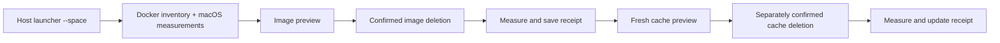

# Reclaim Docker space and retain recent launcher builds

Agent-proposed Pass 0 and Pass 1, as requested; decisions await review. Incident figures come from `PRODUCT_PROBLEM.md`. Code inspected: [`50f3125`](https://github.com/stanislavkozlovski/dclaude/tree/50f31259661621b860e98142e75181436dfea4d8), version 0.1.85. Online sources checked on 6 September 2026; no cleanup was performed.

## Pass 0: Problem or opportunity framing

### Who is the user, what do we know about their behavior, and how correct does the result need to be?

- **User:** Stan, running `dclaude` and `dcodex` on a Mac with a roughly 460 GiB disk.
- **Their behavior:** He repeatedly builds updated launchers and keeps warm containers for several projects.
- **Edge-case tolerance:** Missed cleanup is acceptable; lost environments and false recovery claims are not.

### What is the prevailing user problem or opportunity?

- **Problem or opportunity:** Stan cannot safely turn old Docker builds into free Mac space, so a full disk becomes a manual investigation.

### What is the proposed solution, and why is it right for the user?

- **Solution:** Add `--space` to both launchers for separate image/cache previews, measured cleanup, and opt-in retention.
- **Why it fits the user:** It handles the artifacts his existing workflow creates and preserves the containers he expects to return to.

### How would you describe the end-to-end user experience?

- **End-to-end user experience:** Stan previews old images, applies cleanup, optionally clears retained cache, reads the Mac-space result, and enables retention.

### What existing data, behavior, or integrations must keep working?

- **Legacy data:** Preserve containers, volumes, repositories, auth, and host caches; treat older unlabelled images as unverified.
- **Legacy behavior:** Keep launch, profile, image-override, reset, SSH, and update behavior unless Stan enables retention.
- **Existing integrations:** Preserve shared launchers, tarball/Homebrew installs, and Docker socket exclusion from agent containers.
- **Compatibility tolerance:** Leave unknown artifacts untouched and reject unsupported cleanup state with a next action.

### Agent edge-case scan

The following dispositions are **proposed by the agent**.

| Edge case | What happens if ignored | What handling it adds | User decision |
|---|---|---|---|
| When old builds lack labels, the cleaner cannot establish their origin. | The cleaner strands old builds or guesses ownership. | The cleaner offers legacy release tags for manual review and automates only labelled builds. | HANDLE — proposed |
| When a build retags a previewed image, the cleaner encounters a changed target. | The cleaner may remove an unapproved reference. | The cleaner coordinates launcher operations, rechecks targets, and requires other Docker writers to stay idle. | HANDLE — proposed |
| When a stopped container uses a platform beneath an index, the cleaner sees related IDs. | The cleaner may classify the parent as unused. | The cleaner protects the whole family and skips unresolved relationships. | HANDLE — proposed |
| When another project shares the builder, the cleaner encounters its cache. | The cleaner silently slows unrelated builds. | The cleaner offers a separate builder-wide choice with selected records and rebuild cost. | HANDLE — proposed |
| When Stan selects a remote context, the cleaner encounters another machine. | The cleaner changes the wrong machine. | The cleaner refuses mutation and identifies the local Desktop context to select. | HANDLE — proposed |

The scan covered [build/update/container lifecycle and mounts](scripts/agent-common.sh), the [Dockerfile](Dockerfile), [persisted state](docs/ARCHITECTURE.md#persistent-state), and [release automation](.github/workflows/ci.yml). Neither prototype named in the brief—`macos_space.py`, `prune_dclaude_images.py`—exists here; there is no cleanup schema to migrate.

## Pass 1: High-level design

## Proposal

**Ship a host CLI for diagnosis, image cleanup, a separate cache cleanup, and prevention.** Image deletion alone is an incomplete MVP: BuildKit can retain its layers.

Three product concepts:

| Concept | What it delivers | Decision |
|---|---|---|
| Launcher cleanup and retention | Retire `dclaude` history, explain cache, measure recovery, and prevent accumulation. | Ship here; both wrappers share these images. |
| Docker retention across projects | Apply policies across repositories, builders, and scheduled jobs. | Later, if other projects need recurring retention. |
| Mac developer storage advisor | Explain Docker, Gradle, package caches, snapshots, and directory growth. | Separate product; scanning and application safety dominate its scope. |

### In-scope goals

- Diagnose an incident-sized Docker installation within one minute, exposing incomplete probes.
- Reclaim eligible images/cache, preserve working environments, and record each step's measured result.
- Offer image retention and a reviewed native BuildKit cache budget.

### Out-of-scope non-goals

Whole-disk scanning, arbitrary repositories, remote engines, other VM products, inactive image stores, container/volume deletion, host-cache cleanup, OS/snapshot surgery, and background monitoring. The report describes **Docker coverage**, not all Mac storage.

### Potential scope growth

| Risk | Growth mechanism — when it happens in practice | Explicit cap | Decision |
|---|---|---|---|
| Backend adapters multiply | Each new VM product adds another storage mapping. | One local Desktop daemon, its active store, and default `docker`-driver builder. | CONSTRAIN |
| Ownership guesses multiply | Each shared record invites another source-path heuristic. | Image ownership plus one explicit builder-wide cache stage; zero cache ownership heuristics. | CONSTRAIN |
| Filesystem scans expand | Each unexplained byte invites another directory into the audit. | One disk-image file, its APFS container and the startup container; zero recursive walks. | CONSTRAIN |
| Cleanup retries broaden | Each remaining byte tempts a wider deletion attempt. | Stop on inconsistent evidence, record partial results, and repreview before more deletion. | CONSTRAIN |

### Public behavior changes (before / after)

**Before:** The wrappers build `dclaude:<docs/VERSION>` and reuse warm containers without retention; several release tags can share one image ID.

**After:** Both wrappers offer these host commands outside any target repository; diagnosis starts no agent, build, or launcher update.

```bash
dclaude --space                         # diagnose and preview old images
dclaude --space images --keep 2 --apply  # show a fresh plan, confirm, delete, measure
dclaude --space cache                   # preview cache after image removal
dclaude --space cache --apply           # separately confirm cache deletion, measure
dclaude --space verify                  # remeasure the latest cleanup receipt
dclaude --space retention enable --keep 2
dclaude --space retention status
dclaude --space retention disable
```

`--space --json` emits structured diagnosis; `--disk-image PATH` supplies the location shown in Desktop settings. `--keep N` counts distinct builds, default two. Each apply displays all targets and requires confirmation; existing `--yes` only authorizes updates. `--` still forwards agent arguments. Storage mode requires host Python 3, like tool-pin updates; ordinary launches do not.

### Architecture and safety invariants

A shared host Python helper collects observations, selects candidates, executes confirmed actions, and writes JSON receipts. Bash dispatches before target-repository setup. The invariants are read-only defaults, explicit deletion authority, protection of container-referenced images, no container/volume deletion, no forced image deletion, and no broader fallback after an error. The Docker socket stays outside agent containers.



Collect structured image/container inventory, Buildx usage, disk-image allocation, and APFS counters. Pin the verified daemon and builder: `docker build` and bare Buildx commands can select different builders. Custom builder overrides disable automatic retention. [Builder selection](https://docs.docker.com/build/builders/).

Host-only policy and receipts record identities, decisions, results, timed measurements, and coverage gaps. Missing/inconsistent Docker inventory, unknown state versions, or inability to write the receipt disables apply. Interrupted runs retain partial results; receipts cannot execute actions, and every apply replans.

### Retire builds by identity, with explicit protection

Group tags by immutable image identity. Protect **all running/stopped-container references**, the configured launcher image, and the newest two distinct launcher builds overall, ordered by Docker creation time with an ID tie-break. Preserve every alias of protected images; non-release tags and other-repository aliases also protect their image.

The incident's inventory suggests 13 candidates while retaining `0.1.81` and `0.1.76`; establish that again from live data. Each candidate explains identity, ownership, age/growth, references, rebuild cost, recovery uncertainty, and verification. Legacy release tags need manual review; unlabelled dangling images remain unclassified.

Delete reviewed release tags and positively identified labelled dangling image IDs, without force or parent-image pruning. Recheck identities and references before each deletion. Treat indexes/platforms/attestations as one family, protecting uncertain relationships; Desktop's default containerd store makes this necessary today. [Removal semantics](https://docs.docker.com/reference/cli/docker/image/rm/), [containerd store](https://docs.docker.com/desktop/features/containerd/).

Coordinate our launcher builds and container creation; require other Docker clients and old launchers to remain idle during apply. Rechecks and daemon conflicts stop detected races, but they do not constitute a Docker-wide transaction.

### Clear retained cache as a separate choice

After image removal, take a **new** inventory of reclaimable private cache records; retain shared/in-use records. Show IDs, sizes, last use, and descriptions, explaining that **any project on this builder** may need downloads or recompilation afterward. Shared/private state does not establish source ownership. [Cache accounting](https://docs.docker.com/reference/cli/docker/buildx/du/).

Use approved record IDs with Buildx filters and recheck eligibility; filtering failure never falls back to global pruning. Week one must prove selection and dependency behavior. The documented filters have no repository selector. [Prune filters](https://docs.docker.com/reference/cli/docker/buildx/prune/).

Deletion has no undo: the [Dockerfile](Dockerfile) pins CLIs but uses mutable base tags and package repositories, so rebuilds may differ.

### Explain overlap and prove the observed recovery

Keep three accounting views separate:

| View | What the incident establishes | What it does not establish |
|---|---|---|
| Mac/APFS | Startup free space was 3.82 GiB; Docker's sparse file reported about 43.8 GiB allocated versus 460.4 GiB logical. | The sparse file's logical capacity is not occupied SSD space. |
| Docker images | Candidate images had 19.98 GB, about 18.61 GiB, of Docker-reported unique size. | “Unique” within image accounting does not mean unshared with BuildKit. |
| BuildKit | Cache reported 26.7 GB reclaimable, including 23.01 GB shared and 3.696 GB private. | These categories cannot be added to image usage to promise host recovery. |

Record known tag/image, container/image-family, and cache/parent references; mark unknown edges. Docker accounting does not establish the physical union across blobs, unpacked layers, and APFS. [Image accounting](https://docs.docker.com/reference/cli/docker/system/df/).

Show **0–43.8 GiB as a broad allocation ceiling, not a useful forecast**; narrower estimates have low confidence. The brief's roughly 22 GiB remains a hypothesis. References or snapshots can leave zero recovered bytes. Preserve byte values and distinguish GB from GiB.

Measure the same allocation and APFS free-space counters before each step and afterward for up to 60 seconds. If Docker drops 20 GB and the Mac gains 4 GB, report both plus the disk-image change; the **signed observed host delta** includes concurrent writes.

Docker documents `Docker.raw` recovery within seconds. Otherwise report “recovery not yet observed” and offer `--space verify`; never automatically restart Docker, shrink its disk limit, or invoke privileged reclamation. [Desktop disk-image guidance](https://docs.docker.com/desktop/troubleshoot-and-support/faqs/macfaqs/).

Explain measured cache retention separately from possible delayed deallocation, snapshots/clones, concurrent writes, and uninspected storage. Desktop can hide an inactive store while retaining its data; unknown residuals are not cleanup candidates. [Store switching](https://docs.docker.com/desktop/features/containerd/#switch-image-stores).

Count each APFS container and disk-image identity once; no directory traversal means no firmlink duplication, hard-link summation, or mount crossing. An external disk image gets separate recovery figures from the startup disk. Clone attribution remains approximate. [Apple's APFS accounting](https://support.apple.com/guide/mac-help/mac-shares-space-apfs-volumes-sysp560a2952/mac).

Denied paths are **unmeasured**, never zero; missing required baselines disable apply. Report the path/error and terminal privacy settings: `sudo` does not grant privacy access. Do not require blanket Full Disk Access before diagnosis. [Apple's access controls](https://support.apple.com/en-gb/guide/security/secddd1d86a6/web).

### Prevent recurrence without a second garbage collector

`retention enable` authorizes the displayed image policy for the exact `dclaude` repository; custom image overrides remain outside automatic retention. Label new builds and retire eligible labelled history after successful build **and warm-container bootstrap**; standalone `--update-tool` waits until the next successful launch. Labelled dangling images from rebuilt tags are eligible too. Disabling retention stops future cleanup without deleting state.

Separately propose enabling native GC with `defaultKeepStorage: "5GB"` in **Desktop → Settings → Docker Engine**, preserving other settings. This space-conscious budget affects every project on the builder. Docker owns eviction; the launcher neither edits settings nor restarts Docker automatically. It is a GC target, not a total Docker-space cap. [Native GC](https://docs.docker.com/build/cache/garbage-collection/).

Containers may protect more than two builds and volumes may grow; report these limits without expiring environments. Cleanup failure must not block a healthy agent launch.

### Prototype first, then ship over four weeks

Prototype exact image/cache selection and host deallocation first; these depend on Stan's Desktop version and need Mac experiments.

**One-week validation plan:**

| Day | Experiment and decision evidence |
|---|---|
| 1 | Capture Stan's macOS/Desktop/engine/Buildx versions, active store, context, builder, and disk-image baseline; compare with Desktop. |
| 2 | Reproduce image/cache overlap on a disposable Mac setup; measure image deletion, cache deletion, and delayed host recovery separately. |
| 3 | Check legacy/rebuilt tags, aliases, stopped containers, and platform/index protection, including unsupported-case refusal. |
| 4 | Prove ID-filter selection beside another project's cache; exercise retagging, missing metadata access, interruption, and remote-context rejection. |
| 5 | Have Stan identify cause, candidates, protections, uncertainty, action, and measured outcome from the report without interpreting Docker output. |

Require diagnosis within 60 seconds, protected objects unchanged, and material host recovery in the controlled fixture. An honest zero-recovery receipt alone does not validate cleanup; revise the design if exact selection or host recovery fails.

**Four-week implementation plan:**

| Week | Deliverable |
|---|---|
| 1 | Complete the experiments; establish supported versions and a go/no-go decision. |
| 2 | Deliver collection, previews, protection rules, JSON reports, and wrapper entrypoints. |
| 3 | Deliver confirmed execution, drift/interruption handling, and verification on disposable Mac data. |
| 4 | Add retention/GC guidance; check upgrade/rollback and Homebrew/source installs; dogfood repeated builds. |

These are proposed experiments, not completed tests; implementation details and the validation matrix belong to Pass 2.

## Rejected design alternatives

| Alternative | Why rejected |
|---|---|
| The launcher ships only the brief's image-pruning script. | Image removal can leave BuildKit holding the incident's layers, so the user can do everything requested and recover little host space; the MVP needs the separate cache step and measurement. |
| The launcher runs `docker system prune -a --volumes` on a schedule. | Global pruning combines container state, images, cache, and volume cleanup without the launcher-specific protections; saving one command does not justify that scope. [Docker pruning behavior](https://docs.docker.com/engine/manage-resources/pruning/). |
| The cleaner infers cache ownership from descriptions, labels, or source paths. | Those clues do not prove exclusive ownership of shared cache, so the cleaner could silently evict other projects' work; explicit builder scope is reviewable. |
| The launcher creates a dedicated BuildKit builder immediately. | Isolation makes future cache policy easier but leaves the existing default-builder cache behind and adds builder lifecycle, migration, and possibly duplicate storage; revisit if Stan rejects sharing a cache budget with other projects. [Builder drivers](https://docs.docker.com/build/builders/). |
| The product reconstructs an exact Docker-to-APFS extent graph before offering cleanup. | Public observations do not establish that graph, so this approach makes useful cleanup depend on storage-engine reverse engineering; measured recovery provides the evidence the user actually needs. |
| The launcher switches to a single mutable tag or a build-input hash. | Retagging alone does not release cache or container-held layers, and cached builds can already share image IDs; identity changes also alter the existing release and warm-container workflow. |
| The project first splits Dockerfile layers or publishes prebuilt multi-architecture images. | Smaller rebuilds and less local compilation are useful follow-ups, but neither retires the installed history or proves recovery; registry distribution also creates another release surface. |
| Stan uses Docker Desktop's existing storage controls for every cleanup. | Docker Desktop already shows images, their usage, and deletion controls, making it a good choice for an occasional cleanup; repeated launcher retention plus a per-step host receipt is the reason to add this command. [Existing Images view](https://docs.docker.com/desktop/use-desktop/images/). |
| The project extends a general Mac cleaner instead of owning launcher retention. | DaisyDisk already handles full APFS clones and Mole already offers previews and cleanup history, so generic scanning is not our differentiator; their broader workflows do not establish this launcher's retention rules. [DaisyDisk's clone support and partial-clone limitation](https://daisydiskapp.com/guide/4/en/HardLinks), [Mole's existing workflow](https://github.com/tw93/Mole). |
| The product begins with a menu-bar app, Docker extension, or continuous monitor. | Each adds UI or background lifecycle work before fixing the identified accumulation; a monitor explains future growth but cannot recover today's bytes, and receipts already provide a small history. |
| The tool prints shell commands and leaves all execution to Stan. | A planner removes execution responsibility from the tool but also loses fresh target checks and automatic recovery receipts; retain read-only previews without stopping the product there. |
| The cleaner backs up every artifact, resets `Docker.raw`, or forces compaction to guarantee recovery. | Backups need space the incident machine lacks, and resetting Docker destroys environments; an explicit irreversible cache/image choice with observed recovery fits this use case better than a false undo or recovery promise. |

---

# Legend (do not delete)

Scope growth labels mean:

- **INCLUDE** accepts the resulting scope;
- **CONSTRAIN** limits the behavior that causes it;
- **EXCLUDE** leaves the broader work outside this proposal.

Each label is valid only when its row also names the repeatable growth mechanism and a finite, observable cap.
